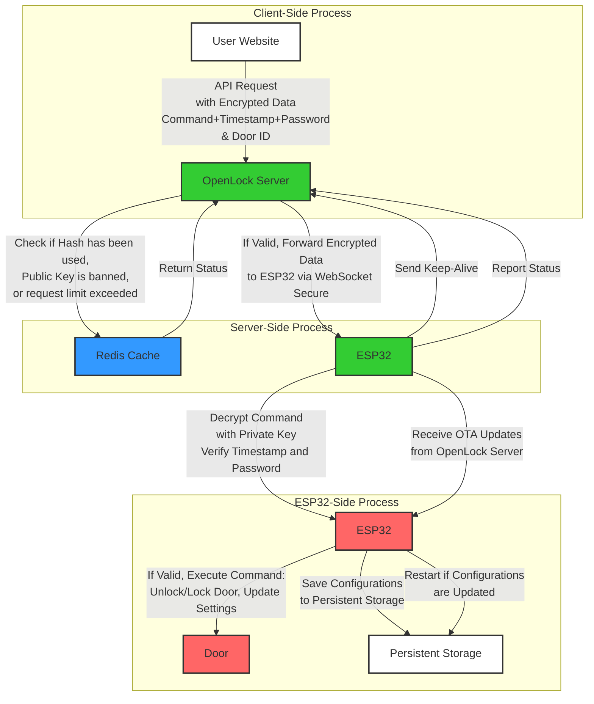

## README.md for OpenLock Server
- Author: lucasodra
- Last Updated: 2024 July 31

# Introduction 

`openlock` is a secure server designed to manage and communicate with ESP32 devices, facilitating the control of physical door locks. The server uses real-time WebSocket communication, robust encryption, and industry-standard security practices to ensure secure transmission and execution of commands. The architecture is built to support high scalability and secure device management.

The **openlock** system is designed to manage and control physical door locks using ESP32 microcontrollers. It facilitates secure communication between clients (such as websites or applications), the OpenLock server, and the ESP32 devices. The architecture is built to ensure security, scalability, and real-time responsiveness.

### Table of Contents

1. [System Architecture](#system-architecture)
2. [System Workflow](#system-workflow)
3. [Tech Stack](#tech-stack)
4. [Security Measures](#security-measures)
5. [Industry Safety Features](#industry-safety-features)
6. [Getting Started](#getting-started)
7. [API Documentation](#api-documentation)
8. [Data Storage in Redis](#data-storage-in-redis)
9. [Unit Testing](#unit-testing)
10. [Functional Testing](#functional-testing)
11. [Contributing](#contributing)
12. [License](#license)

---

## System Architecture

The system architecture involves three main components:

1. **Client**: Sends API requests to the OpenLock server to control ESP32 devices. The client encrypts commands using the ESP32's public key, which is obtained securely from the OpenLock server.

2. **OpenLock Server**: Handles API requests from the client, authenticates clients, and manages secure communication with the ESP32 devices. The server performs critical checks, such as validating the request against replay attacks and checking rate limits, before forwarding the encrypted command to the ESP32 via WebSocket Secure.

3. **ESP32 Device**: An IoT device that connects to the OpenLock server via WebSocket Secure. It receives encrypted commands, decrypts them using a private key, and executes the specified actions, such as unlocking a door or updating its configuration.

**Directory Structure:**

```
OpenLockServer/
├── controllers/
│   ├── authController.js
│   ├── deviceController.js
│   └── commandController.js
├── middleware/
│   ├── authMiddleware.js
│   └── errorMiddleware.js
├── routes/
│   ├── authRoutes.js
│   ├── deviceRoutes.js
│   └── commandRoutes.js
├── services/
│   ├── authService.js
│   ├── deviceService.js
│   └── commandService.js
├── utils/
│   ├── jwtUtils.js
│   └── encryptionUtils.js
├── index.js
├── config.js
└── README.md
```

---

### Architecture Diagram

User Settings for new ESP:
- WIFI SSID
- WIFI Password
- OpenLock Server Address
- Door ID
- Door Password



[Back to Top](#introduction)

---

## System Workflow

1. **Client Authentication**: Users authenticate with the OpenLock server using their email and website URL instead of a traditional username and password. The OpenLock server adds the authenticated website URL to its CORS policy, ensuring that only registered and verified URLs can make API requests. Upon successful authentication, users receive an API access token, which is required for all subsequent API interactions. This token verifies the identity and authorization of the client, ensuring only authenticated users can interact with the system.

2. **ESP32 First Connection**:
   - **HTTPS Request**: When the ESP32 device is first powered on or restarted, it sends an HTTPS request containing its Door ID and Public Key to the OpenLock server. The server responds with a unique session token, generated for that session.
   - **WebSocket Connection**: The ESP32 then establishes a WebSocket connection with the OpenLock server, sending the Door ID and session token. The server verifies the session token against the Door ID and stores the WebSocket connection along with the associated Door ID for future communications.

3. **Public Key Retrieval**:
   - **Client Request**: The client application sends an HTTPS request to the OpenLock server to retrieve the public key associated with a specific Door ID. The input to this request is the Door ID.
   - **Public Key Delivery**: The OpenLock server fetches the public key from the Redis cache or another secure storage location and returns it to the client. If the public key is not found, the server denies the request.

4. **Command Encryption and Forwarding**:
   - **Command Preparation**: The client uses the retrieved public key to encrypt the command, timestamp, and door password using AES-256 encryption. This encrypted data ensures that only the intended ESP32 device can decrypt and process the command.
   - **Client Command Request**: The encrypted command, along with the unencrypted Door ID, is sent to the OpenLock server using the API access token.
   - **Verification and Forwarding**: The OpenLock server verifies the API access token and session token associated with the Door ID. It then forwards the encrypted command to the specified ESP32 device via WebSocket Secure.

5. **Command Reception and Decryption**: The ESP32 device receives the encrypted command through the secure WebSocket connection. It decrypts the command using its private key and verifies the timestamp to ensure the command is fresh and valid. The ESP32 also checks the door password for correctness.

6. **Action Execution**: If the command is valid and authorized, the ESP32 device executes the specified action, such as unlocking/locking the door or updating critical configuration settings like the WiFi SSID, WiFi Password, OpenLock Server Address, Door ID, or Door Password. If the command involves updating configuration settings, the ESP32 saves the changes to persistent storage and restarts to apply the new settings.

7. **Keep-Alive and Reconnection**: To maintain a continuous and reliable connection, the ESP32 devices periodically send keep-alive messages to the OpenLock server. If the connection is lost, the devices automatically attempt to reconnect.

8. **OTA Updates**: The system supports Over-the-Air (OTA) updates, allowing the OpenLock server to push firmware updates to the ESP32 devices. This feature ensures that devices receive the latest security patches and functionality improvements without requiring physical access.

9. **Logging and Monitoring**: The system logs all actions, including successful and failed authentication attempts, command executions, and system errors. These logs are monitored for auditing and security purposes, helping to detect and respond to anomalies or potential security threats.

### In Summary:
- **ESP32 First Connection to OpenLock Server**:
  - **Broadcast Door ID and Public Key**: ESP32 sends Door ID and Public Key via HTTPS and receives a session token.
  - **OpenLock Acknowledge**: Server stores Door ID and Public Key pair along with session token.
  - **Establish WebSocket Connection**: ESP32 connects via WebSocket, sending Door ID and session token for verification.

- **Public Key Retrieval**:
  - **Client Request**: The client requests the public key for a specific Door ID from the OpenLock server.
  - **Server Response**: The server responds with the public key, enabling the client to encrypt commands.

- **OpenLock Server Forward Command to ESP32**:
  - **Receive Encrypted Command**: Server receives the encrypted command and Door ID from the client.
  - **Forward to ESP32**: Server forwards the command to ESP32 via WebSocket.
  - **ESP32 Response**: ESP32 processes the command and sends a response status.

- **OpenLock Server Request Status from ESP32**:
  - **Request Status**: Server sends a status request via WebSocket.
  - **Receive Status**: ESP32 sends back its status.
  - **Client Notification**: Server forwards the status to the client.

[Back to Top](#introduction

)

---

### Tech Stack

The `openlock` system utilizes the following technologies:

1. **Node.js**: JavaScript runtime built on Chrome's V8 JavaScript engine. It is used to build the OpenLock server, handling API requests, and WebSocket communications.
2. **Express.js**: Web application framework for Node.js. It is used to build the API endpoints and handle HTTP requests.
3. **WebSocket**: Protocol for full-duplex communication channels over a single TCP connection. It is used for real-time communication between the OpenLock server and ESP32 devices.
4. **Redis**: In-memory data structure store, used as a database, cache, and message broker. It stores critical data such as public keys, session tokens, and connection statuses.
5. **JSON Web Token (JWT)**: Open standard for creating tokens that assert claims between parties. It is used for authenticating API requests.
6. **AES-256 Encryption**: Symmetric encryption algorithm. It is used for encrypting commands sent to ESP32 devices.
7. **RSA Encryption**: Asymmetric encryption algorithm. It is used for securing communication between the client and the OpenLock server.
8. **TLS/SSL**: Protocols for encrypting data over the network. It is used for securing HTTP and WebSocket communications.
9. **Docker**: Platform for developing, shipping, and running applications inside containers. It is used for containerizing the OpenLock server to ensure consistent environments and easy deployment.

[Back to Top](#introduction)

---

## Security Measures

### 1. **TLS Encryption**
- All communications between clients, the OpenLock server, and ESP32 devices are secured using Transport Layer Security (TLS). This protocol ensures that data is encrypted during transmission, protecting against eavesdropping and tampering. TLS also provides data integrity, ensuring that messages cannot be altered without detection. This encryption is crucial for maintaining the confidentiality and integrity of data exchanges.

### 2. **Public-Private Key Encryption**
- Commands are encrypted with the ESP32's public key and can only be decrypted by the corresponding private key stored securely on the device. This asymmetrical encryption ensures that sensitive data, such as commands to unlock a door, cannot be intercepted or modified during transit. The private key never leaves the ESP32 device, providing an additional layer of security. The public key is transmitted to the OpenLock server via HTTPS, minimizing the risk of exposure.

### 3. **Mutual Authentication**
- Mutual authentication is enforced, requiring both the OpenLock server and the ESP32 devices to authenticate each other before establishing a connection. This two-way verification process ensures that only authorized devices and servers can communicate, preventing unauthorized devices from accessing the system and ensuring secure communication.

### 4. **Token-Based Authentication**
- Clients must obtain a JSON Web Token (JWT) to authenticate API requests to the OpenLock server. JWTs are issued after successful authentication, using the user's email and website URL. The website URL is registered with the server and added to the CORS policy, restricting API access to trusted domains only. This ensures that only registered and verified websites can make API requests, enhancing security. JWTs have expiration times to limit their validity period, and the server can refresh or revoke tokens as necessary.

### 5. **CORS Policy Enforcement**
- The OpenLock server enforces a strict Cross-Origin Resource Sharing (CORS) policy, allowing API requests only from registered and verified website URLs. This is part of the authentication process where users provide their email and website URL. The CORS policy helps prevent unauthorized websites from accessing the API, mitigating risks from cross-origin attacks and ensuring that only trusted clients can interact with the system.

### 6. **Rate Limiting and IP Blocking**
- The OpenLock server implements rate limiting to control the number of requests each token can make per second. This measure prevents abuse and protects the server from Denial of Service (DoS) attacks. Additionally, IP addresses showing suspicious behavior, such as exceeding rate limits or attempting unauthorized access, are temporarily blocked to protect against potential threats.

### 7. **Unique Device Identifiers**
- Each ESP32 device is assigned a unique identifier (UID) and a corresponding RSA key pair. The UID is used by the server to target specific devices when issuing commands, ensuring that each device can be uniquely addressed and authenticated. This prevents unauthorized devices from executing commands and ensures secure device management.

### 8. **Over-The-Air (OTA) Updates**
- The system supports OTA updates, allowing secure firmware upgrades without physical access to the ESP32 devices. This capability is crucial for deploying security patches and new features promptly, ensuring that all devices in the network run the latest and most secure firmware. OTA updates are securely transmitted and verified before application to ensure integrity and authenticity.

### 9. **Fail-Safe Mechanisms**
- In the event of a network failure or inability to contact the OpenLock server, ESP32 devices operate based on pre-configured fail-safe settings. These settings ensure that the system remains secure, maintaining the current state or reverting to a default secure state. This ensures continuous protection even if the system goes offline.

[Back to Top](#introduction)

---

## Industry Safety Features

- **Replay Attack Prevention**: Each command sent to an ESP32 device includes a unique timestamp and nonce. The OpenLock server checks if the hash of the encrypted data has been transmitted before and validates that the timestamp is within a 1-minute window. This prevents replay attacks, where an attacker could potentially re-send captured messages to replay commands, ensuring that each command is unique and timely.

- **Data Integrity**: All data transmitted between the server and devices is verified for integrity using cryptographic checksums. This ensures that any tampering with the data can be detected and mitigated. The system's use of cryptographic checksums protects against unauthorized data manipulation, ensuring that all data remains accurate and trustworthy.

- **Access Control**: The system employs role-based access control (RBAC), defining specific permissions for different types of users and devices. This ensures that only authorized users can issue sensitive commands, such as unlocking a door. RBAC helps manage access rights and enhances overall security by limiting actions to specific roles, reducing the risk of unauthorized access.

- **Logging and Monitoring**: The OpenLock system logs all actions, including successful and unsuccessful authentication attempts, command executions, and system errors. This data is monitored to detect suspicious activity and respond quickly to potential security threats, providing a robust audit trail for forensic analysis. Logging and monitoring are crucial for identifying and mitigating potential security issues, ensuring the system remains secure and reliable.

[Back to Top](#introduction)

---

## Getting Started

### Prerequisites

### Docker

To run the openlock system, Docker is used for containerization, ensuring consistent environments and easy deployment.

**Start with Docker Compose:**

1. **Start the system**:

   ```bash
   docker compose up
   ```

   NGINX proxies requests from port 8080 to the Node.js server.

**Node.js Server Only:**

1. **Build the Docker image**:

   ```bash
   docker build -t openlock-node-app .
   ```

2. **Run the Docker container**:

   ```bash
   docker run -p 3000:3000 -d openlock-node-app
   ```

3. **View Docker logs**:

   ```bash
   docker ps
   docker logs -f -t [container_id_or_name]
   ```

4. **Update the Docker image**:

   ```bash
   docker build -t openlock-node-app:latest . --platform linux/amd64
   ```

**Pushing to Docker Hub:**  
Refer to [Docker's guide on sharing images](https://docs.docker.com/get-started/04_sharing_app/).

### Installation and Setup

1. **Clone the repository**:

   ```bash
   git clone https://github.com/lucasodra/openlock
   cd openlock
   ```

2. **Install dependencies**:

   ```bash
   npm install
   ```

3. **Set up your environment**:

   Copy `env.example` to a new file named `.env` and update it with the required environment variables:

   ```bash
   cp env.example .env
   ```

4. **Start the server**:

   ```bash
   npm run dev
   ```

   The server runs on `http://localhost:3000` by default.

### Testing SSL/TLS

**Check if SSL is enabled:**

```bash
curl --insecure https://localhost/health
```

**Check if SSL is not enabled:**

```bash
curl --insecure http://localhost/health
```

---

## API Documentation

### 1. **ESP32 First Connection to OpenLock Server**

#### Endpoint: `/api/register`

**Description**: Handles the first connection from an ESP32 device to register the device by broadcasting its Door ID and Public Key.

**Method**: `POST`

- **Input (via HTTPS POST)**:
  ```json
  {
    "doorId": "your_door_id_here",
    "publicKey": "your_public_key_here"
  }
  ```

- **Output (via HTTPS)**:
  - **Success Response**:
    ```json
    {
      "status": "success",
      "message": "Device registered successfully."
    }
    ```
  - **Error Response**:
    ```json
    {
      "status": "error",
      "message": "Failed to register device."
    }
    ```

**Process**:
- ESP32 broadcasts its Door ID and Public Key to OpenLock.
- OpenLock stores the Door ID and Public Key in Redis and sends an acknowledgment message.

---

### 2. **Public Key Retrieval**

#### Endpoint: `/api/getPublicKey`

**Description**: Retrieves the public key associated with a specific Door ID.

**Method**: `GET`

- **Input (via URL Parameters)**:
  - `doorId`: The unique identifier for the ESP32 device.

- **Output (via HTTPS)**:
  - **Success Response**:
    ```json
    {
      "publicKey": "public_key_of_the_device"
    }
    ```
  - **Error Responses**:
    - **Public Key Not Found**:
      ```json
      {
        "status": "error",
        "message": "Public key not found."
      }
      ```
    - **General Error**:
      ```json
      {
        "status": "error",
        "message": "Failed to retrieve public key."
      }
      ```

**Process**:
- Client requests the public key for a specific Door ID.
- OpenLock retrieves the public key from Redis and returns it to the client.

---

### 3. **Forward Command to ESP32**

#### Endpoint: `/api/forwardCommand`

**Description**: Forwards an encrypted command to the ESP32 device.

**Method**: `POST`

- **Input (via HTTPS POST)**:
  ```json
  {
    "token": "jwt_token",
    "doorId": "your_door_id_here",
    "encryptedCommand": "base64_encoded_encrypted_command"
  }
  ```

- **Output (via HTTPS)**:
  - **Success Response**:
    ```json
    {
      "status": "success",
      "message": "Command forwarded successfully.",


      "deviceResponse": "response_from_device"
    }
    ```
  - **Error Responses**:
    - **Invalid Token**:
      ```json
      {
        "status": "error",
        "message": "Invalid token."
      }
      ```
    - **Device Not Connected**:
      ```json
      {
        "status": "error",
        "message": "Device not connected."
      }
      ```
    - **Device Response Error**:
      ```json
      {
        "status": "error",
        "message": "Error from device.",
        "deviceResponse": "error_detail"
      }
      ```

**Process**:
- Client sends a POST request with the encrypted command and Door ID.
- OpenLock verifies the JWT token and forwards the encrypted command to the corresponding ESP32 device via WebSocket.
- ESP32 processes the command and sends a response status.
- OpenLock returns the response status from the ESP32 to the client.

---

### 4. **Request Status from ESP32**

#### Endpoint: `/api/getDeviceStatus`

**Description**: Requests the current status from an ESP32 device.

**Method**: `GET`

- **Input (via URL Parameters)**:
  - `doorId`: The unique identifier for the ESP32 device.

- **Output (via HTTPS)**:
  - **Success Response**:
    ```json
    {
      "status": "success",
      "data": {
        "connectionStatus": "connected/disconnected",
        "lastCommandStatus": "success/error",
        "lastActivity": "ISO_8601_timestamp"
      }
    }
    ```
  - **Error Responses**:
    - **Device Not Connected**:
      ```json
      {
        "status": "error",
        "message": "Device not connected."
      }
      ```
    - **Error Getting Status**:
      ```json
      {
        "status": "error",
        "message": "Error retrieving device status."
      }
      ```

**Process**:
- Client sends a GET request to retrieve the status of a specific ESP32 device.
- OpenLock sends a status request via WebSocket to the ESP32 device.
- ESP32 responds with the current status.
- OpenLock returns the status information to the client.

---

### 5. **Update Device Configuration**

#### Endpoint: `/api/updateConfig`

**Description**: Updates the configuration settings of an ESP32 device, such as WiFi credentials or server address.

**Method**: `POST`

- **Input (via HTTPS POST)**:
  ```json
  {
    "token": "jwt_token",
    "doorId": "your_door_id_here",
    "newConfig": {
      "wifiSSID": "new_wifi_ssid",
      "wifiPassword": "new_wifi_password",
      "serverAddress": "new_server_address",
      "doorPassword": "new_door_password"
    }
  }
  ```

- **Output (via HTTPS)**:
  - **Success Response**:
    ```json
    {
      "status": "success",
      "message": "Configuration updated successfully."
    }
    ```
  - **Error Responses**:
    - **Invalid Token**:
      ```json
      {
        "status": "error",
        "message": "Invalid token."
      }
      ```
    - **Device Not Connected**:
      ```json
      {
        "status": "error",
        "message": "Device not connected."
      }
      ```
    - **Update Failed**:
      ```json
      {
        "status": "error",
        "message": "Failed to update configuration."
      }
      ```

**Process**:
- Client sends a POST request with the new configuration settings.
- OpenLock verifies the JWT token and forwards the configuration update to the ESP32 device via WebSocket.
- ESP32 updates its settings and sends a confirmation response.
- OpenLock returns the update confirmation to the client.

---

### 6. **Over-the-Air (OTA) Firmware Update**

#### Endpoint: `/api/otaUpdate`

**Description**: Initiates an Over-the-Air (OTA) firmware update for an ESP32 device.

**Method**: `POST`

- **Input (via HTTPS POST)**:
  ```json
  {
    "token": "jwt_token",
    "doorId": "your_door_id_here",
    "firmwareUrl": "url_to_firmware_file"
  }
  ```

- **Output (via HTTPS)**:
  - **Success Response**:
    ```json
    {
      "status": "success",
      "message": "OTA update initiated."
    }
    ```
  - **Error Responses**:
    - **Invalid Token**:
      ```json
      {
        "status": "error",
        "message": "Invalid token."
      }
      ```
    - **Device Not Connected**:
      ```json
      {
        "status": "error",
        "message": "Device not connected."
      }
      ```
    - **Update Failed**:
      ```json
      {
        "status": "error",
        "message": "Failed to initiate OTA update."
      }
      ```

**Process**:
- Client sends a POST request with the firmware URL for OTA update.
- OpenLock verifies the JWT token and forwards the OTA update command to the ESP32 device via WebSocket.
- ESP32 downloads and applies the firmware update.
- OpenLock returns the update initiation confirmation to the client.

---

## Data Storage in Redis

Redis is used to store temporary and critical data to support the operations of the OpenLock server. The following data and datatypes are stored in Redis:

1. **Door ID and Public Key**:
   - **Key**: `doorId:<doorId>`
   - **Value**: Public Key (String)

   This key-value pair is used to store the public key associated with each door ID for encrypting commands.

2. **Session Token**:
   - **Key**: `sessionToken:<doorId>`
   - **Value**: Session Token (String)

   This key-value pair stores the session token generated during the first connection of the ESP32 device.

3. **Connection Status**:
   - **Key**: `connectionStatus:<doorId>`
   - **Value**: Connection Status (String) - values can be `connected` or `disconnected`

   This key-value pair tracks the connection status of each ESP32 device.

4. **Last Activity Timestamp**:
   - **Key**: `lastActivity:<doorId>`
   - **Value**: ISO 8601 Timestamp (String)

   This key-value pair stores the timestamp of the last activity or command processed by each ESP32 device.

5. **JWT Tokens**:
   - **Key**: `jwt:<email>`
   - **Value**: JWT Token (String)

   This key-value pair stores the JWT tokens issued to clients for API authentication.

6. **Command Status**:
   - **Key**: `commandStatus:<doorId>`
   - **Value**: Command Status (String) - values can be `success` or `error`

   This key-value pair stores the status of the last command executed by each ESP32 device.

7. **Rate Limiting and IP Blocking**:
   - **Key**: `rateLimit:<ipAddress>`
   - **Value**: Request Count (Integer)

   This key-value pair is used for rate limiting by tracking the number of requests from each IP address.

### Example Redis Commands

1. **Storing a Public Key**:
   ```redis
   SET doorId:12345 "public_key_here"
   ```

2. **Retrieving a Public Key**:
   ```redis
   GET doorId:12345
   ```

3. **Storing a Session Token**:
   ```redis
   SET sessionToken:12345 "session_token_here"
   ```

4. **Retrieving a Session Token**:
   ```redis
   GET sessionToken:12345
   ```

5. **Storing Connection Status**:
   ```redis
   SET connectionStatus:12345 "connected"
   ```

6. **Retrieving Connection Status**:
   ```redis
   GET connectionStatus:12345
   ```

7. **Storing Last Activity Timestamp**:
   ```redis
   SET lastActivity:12345 "2024-07-31T12:34:56Z"
   ```

8. **Retrieving Last Activity Timestamp**:
   ```redis
   GET lastActivity:12345
   ```

9. **Storing a JWT Token**:
   ```redis
   SET jwt:user@example.com "jwt_token_here"
   ```

10. **Retrieving a JWT Token**:
    ```redis
    GET jwt:user@example.com
    ```

11. **Incrementing Rate Limit Counter**:
    ```redis
    INCR rateLimit:192.168.1.1
    ```

12. **Retrieving Rate Limit Counter**:
    ```redis
    GET rateLimit:192.168.1.1
    ```

[Back to Top](#introduction)

---

## Unit Testing

Unit testing is a crucial aspect of ensuring the reliability and correctness of the OpenLock server's codebase. The following sections detail the setup and execution of unit tests for the various components of the OpenLock server.

### Setting Up Unit Tests

To set up the unit tests, ensure that you have the necessary dependencies installed. The primary testing frameworks and libraries used are:

- **Mocha**: JavaScript test framework running on Node.js.
- **Chai**: BDD / TDD assertion library for Node.js and the browser.
- **Sinon**: Standalone test spies, stubs, and mocks for JavaScript.

You can install these dependencies using npm:

```bash
npm install mocha chai sinon --save-dev
```

### Running Unit Tests

The unit tests are organized within the `app/tests` directory, structured by component type (controllers, middleware, services, utils). You can run all the tests using the following command:

```bash
npm test
```

### Example Unit Test: authController.test.js

```javascript
import { expect } from 'chai';
import request from 'supertest';
import express from 'express';
import authController from '../controllers/authController';

const app = express();
app.use(express.json());
app.post('/login', authController.login);

describe('Auth Controller', () => {
  it('should return a token for valid user', async () => {
    const response = await request(app)
      .post('/login')
      .send({ email: 'user@example.com', websiteUrl: 'http://openlock.io' });

    expect(response.status).to.equal(200);
    expect(response.body).to.have.property('token');
  });

  it('should return 400 for invalid user', async () => {
    const response = await request(app)
      .post('/login')
      .send({ email: 'invalid@example.com', websiteUrl: 'http://invalid.io' });

    expect(response.status).to.equal(400);
    expect(response.text).to.equal('Invalid email or website URL.');
  });
});
```

---

## Functional Testing

Functional testing ensures that the OpenLock server operates correctly with all its integrated components and meets the specified requirements. These tests focus on the system's functionality from an end-user perspective.

### Setting Up Functional Tests

Functional tests require a running instance of the OpenLock server and its dependencies (e.g., Redis). Docker Compose is used to set up the testing environment.

1. **Start the Docker Compose environment**:

   ```bash
   docker compose up -d
   ```

2. **Run the functional tests** using a testing framework like Mocha. Ensure that your tests are located in a specific directory, such as `app/functional-tests`.

### Running Functional Tests

You can run the functional tests with the following command:

```bash
mocha 'app/functional-tests/**/*.test.js'
```

### Example Functional Test: End-to-End Device Registration

```javascript
import { expect } from 'chai';
import request from 'supertest';
import express from 'express';
import authController from '../controllers/authController';
import deviceController from '../controllers/deviceController';
import { setupDatabase, teardownDatabase } from './utils';

const app = express();
app.use(express.json());
app.post('/login', authController.login);
app.post('/register', deviceController.registerDevice);

describe('End-to-End Device Registration', () => {
  before(async () => {
    await setupDatabase();
  });

  after(async () => {
    await teardownDatabase();
  });

  it('should register a device successfully', async () => {
    const loginResponse = await request(app)
      .post('/login')
      .send({ email: 'user@example.com', websiteUrl: 'http://openlock.io' });

    const token = loginResponse.body.token;

    const registerResponse = await request(app)
      .post('/register')
      .set('Authorization', `Bearer ${token}`)
      .send({ doorId: 'door123', publicKey: 'public_key_here' });

    expect(registerResponse.status).to.equal(200);
    expect(registerResponse.body.message).to.equal('Device registered successfully.');
  });
});
```

[Back to Top](#introduction)

---

## Contributing

We welcome contributions to enhance the security and functionality of the OpenLock system. Please fork the repository and create a pull request with your changes.

## License

This project is licensed under the MIT License - see the [LICENSE](LICENSE) file for details.

