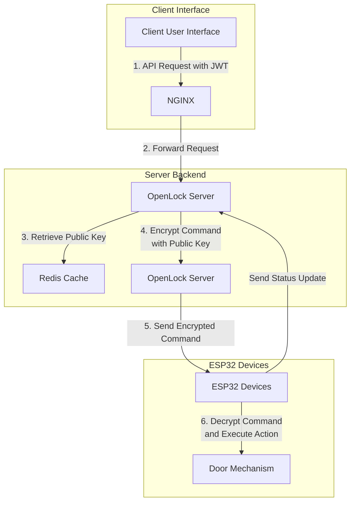

## README.md for esplock
- Author: lucasodra
- Last Updated: 2024 July 31
# openlock
### Overview

openlock is a secure server designed to manage and communicate with ESP32 devices, facilitating the control of physical door locks. The server uses real-time WebSocket communication, robust encryption, and industry-standard security practices to ensure secure transmission and execution of commands. The architecture is built to support high scalability and secure device management.

### Table of Contents

1. [Architecture](#architecture)
2. [Docker](#docker)
3. [Installation and Setup](#installation-and-setup)
4. [API Usage](#api-usage)
5. [Security Measures](#security-measures)
6. [Testing SSL/TLS](#testing-ssltls)

### Architecture

The **openlock** system is designed to manage and control physical door locks using ESP32 microcontrollers. It facilitates secure communication between clients (such as websites or applications), the OpenLock server, and the ESP32 devices. The architecture is built to ensure security, scalability, and real-time responsiveness.

#### System Components

1. **Client (User Interface)**:
   - Users interact with the system through a web application or other interfaces, sending requests to control doors (e.g., to unlock or lock them).

2. **OpenLock Server**:
   - The core server application, written in Node.js, handles incoming API requests from clients, manages WebSocket connections with ESP32 devices, and implements business logic such as command validation and encryption.

3. **NGINX**:
   - Acts as a reverse proxy and load balancer, forwarding client requests to the appropriate backend services. NGINX also handles SSL termination, ensuring secure HTTPS communication with clients.

4. **Redis**:
   - Used for caching public keys and session data, improving response times and reducing database load. Redis also assists in managing rate limiting and session persistence.

5. **ESP32 Devices (esplock)**:
   - These microcontrollers are installed on physical doors and connect to the OpenLock server via WebSocket. They receive encrypted commands, decrypt them, and execute actions such as unlocking or locking doors.

#### Workflow

1. **Client Authentication**: Clients authenticate with the OpenLock server using JWTs, which are required for all API interactions.
2. **Command Request**: Authenticated clients send a command request to the server, specifying the desired action and the target ESP32 device.
3. **Public Key Retrieval**: The server retrieves the public key of the target ESP32 from Redis.
4. **Command Encryption**: The server encrypts the command with the ESP32's public key and forwards it via WebSocket.
5. **Command Execution**: The ESP32 decrypts the command, validates it, and performs the requested action (e.g., unlocks the door).
6. **Feedback Loop**: The ESP32 can send status updates or logs back to the server for monitoring and auditing.

#### Mermaid Diagram



### Notes

1. **NGINX as Reverse Proxy and Load Balancer**:
   - NGINX handles incoming HTTPS requests, providing SSL/TLS termination and forwarding them to the appropriate backend services. It also acts as a load balancer, distributing traffic among multiple instances of the OpenLock server to ensure scalability and high availability.

2. **OpenLock Server**:
   - The server implements business logic, including authentication, authorization, command validation, and encryption. It also manages WebSocket connections, ensuring real-time communication with ESP32 devices.

3. **Redis for Caching and Session Management**:
   - Redis is used to store session information, public keys, and other frequently accessed data. This reduces the load on the database and improves the system's response times.

4. **ESP32 Devices (esplock)**:
   - The ESP32 microcontrollers are critical components of the system, responsible for receiving and executing commands securely. They connect to the OpenLock server over WebSocket, ensuring real-time updates and actions. Each device is equipped with RSA key pairs for secure communication.

5. **Security Measures**:
   - The architecture includes several layers of security, such as SSL/TLS for data encryption in transit, RSA for secure command transmission, JWT for client authentication, and role-based access control. These measures ensure that only authorized users and devices can interact with the system, protecting against unauthorized access and potential attacks.

**Directory Structure:**

```
OpenLockServer/
├── controllers/
│   ├── authController.js
│   ├── deviceController.js
│   └── commandController.js
├── middleware/
│   ├── authMiddleware.js
│   └── errorMiddleware.js
├── routes/
│   ├── authRoutes.js
│   ├── deviceRoutes.js
│   └── commandRoutes.js
├── services/
│   ├── authService.js
│   ├── deviceService.js
│   └── commandService.js
├── utils/
│   ├── jwtUtils.js
│   └── encryptionUtils.js
├── index.js
├── config.js
└── README.md
```

### Docker

To run the openlock system, Docker is used for containerization, ensuring consistent environments and easy deployment.

**Start with Docker Compose:**

1. **Start the system**:

   ```bash
   docker compose up
   ```

   NGINX proxies requests from port 8080 to the Node.js server.

**Node.js Server Only:**

1. **Build the Docker image**:

   ```bash
   docker build -t openlock-node-app .
   ```

2. **Run the Docker container**:

   ```bash
   docker run -p 3000:3000 -d openlock-node-app
   ```

3. **View Docker logs**:

   ```bash
   docker ps
   docker logs -f -t [container_id_or_name]
   ```

4. **Update the Docker image**:

   ```bash
   docker build -t openlock-node-app:latest . --platform linux/amd64
   ```

**Pushing to Docker Hub:**  
Refer to [Docker's guide on sharing images](https://docs.docker.com/get-started/04_sharing_app/).

### Installation and Setup

1. **Clone the repository**:

   ```bash
   git clone https://github.com/lucasodra/openlock
   cd openlock
   ```

2. **Install dependencies**:

   ```bash
   npm install
   ```

3. **Set up your environment**:

   Copy `env.example` to a new file named `.env` and update it with the required environment variables:

   ```bash
   cp env.example .env
   ```

4. **Start the server**:

   ```bash
   npm run dev
   ```

   The server runs on `http://localhost:3000` by default.

### Security Measures

The openlock system implements several industry-standard security measures to ensure the integrity and confidentiality of the system:

1. **TLS/SSL Encryption**:
   - All communications between clients, the OpenLock server, and ESP32 devices are encrypted using TLS/SSL. This ensures that data transmitted over the network is secure from eavesdropping and tampering.

2. **Mutual Authentication**:
   - The system requires mutual authentication between the server and ESP32 devices, ensuring that only trusted devices can connect and communicate.

3. **Public-Private Key Encryption**:
   - Commands sent to ESP32 devices are encrypted using the device's public key and decrypted using the private key stored on the device. This ensures that only authorized devices can interpret the commands.

4. **JWT Authentication**:
   - Clients must authenticate with a JSON Web Token (JWT) to make API requests. This token is validated on each request to ensure only authenticated users can interact with the system.

5. **Rate Limiting and IP Whitelisting**:
   - The server implements rate limiting to prevent abuse and potential denial-of-service attacks. IP whitelisting further restricts access to trusted networks.

6. **Role-Based Access Control (RBAC)**:
   - The system uses RBAC to define permissions based on user roles, ensuring that only authorized users can perform certain actions.

7. **Secure Data Storage**:
   - Sensitive information, such as private keys and passwords, are securely stored and accessed using industry-standard encryption methods.

8. **Audit Logging**:
   - All significant actions and access attempts are logged for auditing and monitoring purposes. This helps in tracking system usage and identifying potential security issues.

### Testing SSL/TLS

**Check if SSL is enabled:**

```bash
curl --insecure https://localhost/health
```

**Check if SSL is not enabled:**

```bash
curl --insecure http://localhost/health
```

## API Documentation

### 1. **ESP32 First Connection to OpenLock Server**

#### Endpoint: `/api/register`

**Description**: Handles the first connection from an ESP32 device to register the device by broadcasting its Door ID and Public Key.

- **Input (via HTTPS POST)**:
  ```json
  {
    "doorID": "your_door_id_here",
    "publicKey": "your_public_key_here"
  }
  ```

- **Output (via HTTPS)**:
  ```json
  {
    "status": "success",
    "message": "Device registered successfully"
  }
  ```

  - **Error Response**:
    ```json
    {
      "status": "error",
      "message": "Registration failed"
    }
    ```

**Process**:
- ESP32 broadcasts its Door ID and Public Key to OpenLock via WebSocket.
- OpenLock stores the Door ID and Public Key in Redis and sends an acknowledgment message.

### 2. **Forward Command to ESP32**

#### Endpoint: `/api/forwardCommand`

**Description**: Forwards an encrypted command to the ESP32 device.

- **Input (via HTTP POST)**:
  ```json
  {
    "token": "jwt_token",
    "doorID": "your_door_id_here",
    "encryptedData": "base64_encoded_encrypted_command"
  }
  ```

- **Output (HTTP Response)**:
  - **Success Response**:
    ```json
    {
      "status": "success",
      "message": "Command forwarded successfully",
      "deviceResponse": "response_from_device"
    }
    ```
  - **Error Responses**:
    - **Invalid Token**:
      ```json
      {
        "status": "error",
        "message": "Invalid token"
      }
      ```
    - **Device Not Connected**:
      ```json
      {
        "status": "error",
        "message": "WebSocket connection not available"
      }
      ```
    - **Device Response Error**:
      ```json
      {
        "status": "error",
        "message": "Error from device",
        "deviceResponse": "error_detail"
      }
      ```

**Process**:
- Client sends a POST request with the encrypted command and Door ID.
- OpenLock verifies the JWT token and forwards the encrypted command to the corresponding ESP32 device via WebSocket.
- ESP32 processes the command and sends a response status (200 for success, 400 for failure).
- OpenLock returns the response status from the ESP32 to the client.

### 3. **Request Status from ESP32**

#### Endpoint: `/api/getDeviceStatus`

**Description**: Requests the current status from an ESP32 device.

- **Input (via HTTP GET)**:
  - URL Parameters:
    - `doorID`: The unique identifier for the ESP32 device.

- **Output (HTTP Response)**:
  - **Success Response**:
    ```json
    {
      "status": "success",
      "data": {
        "connectionStatus": "connected/disconnected",
        "lastActivity": "ISO_8601_timestamp",
        "wifiSSID": "current_wifi_ssid",
        "wifiPassword": "current_wifi_password"
      }
    }
    ```
  - **Error Responses**:
    - **Device Not Connected**:
      ```json
      {
        "status": "error",
        "message": "WebSocket connection not available"
      }
      ```
    - **Error Getting Status**:
      ```json
      {
        "status": "error",
        "message": "Error retrieving device status"
      }
      ```

**Process**:
- Client sends a GET request to retrieve the status of a specific ESP32 device.
- OpenLock sends a status request via WebSocket to the ESP32 device.
- ESP32 responds with the current status, including connection status, last activity timestamp, WiFi SSID, and WiFi password.
- OpenLock returns the status information to the client.

---

**General Notes**:
- **JWT Authentication**: All API requests that require authentication (e.g., forwarding commands) must include a valid JWT token in the request body.
- **CORS Policy**: Only registered website URLs will be allowed to call these APIs, as specified in the CORS policy set by OpenLock during user registration.
- **Redis Storage**: Redis is used for storing temporary data such as public keys, connection status, last activity timestamps, and tokens for validating requests.

## Contributing

We welcome contributions to enhance the security and functionality of the esplock system. Please fork the repository and create a pull request with your changes.

## License

This project is licensed under the MIT License - see the [LICENSE](LICENSE) file for details.